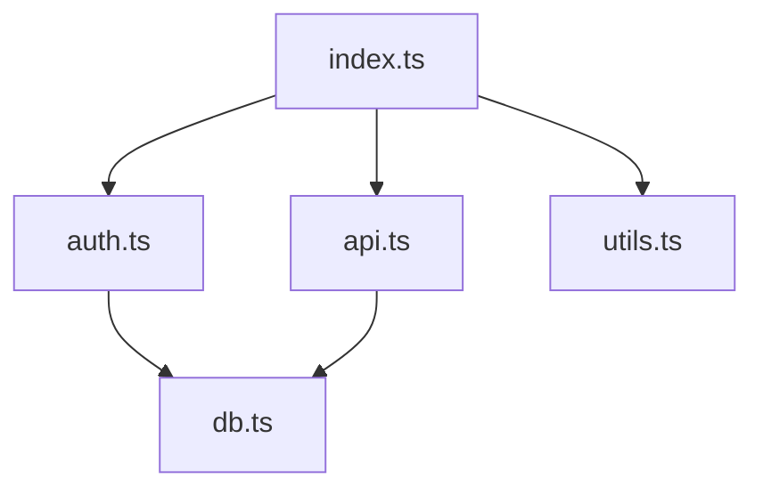
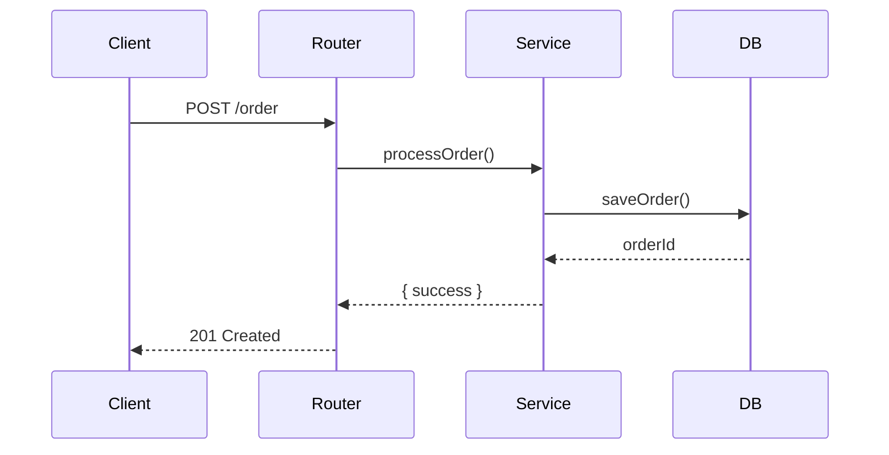
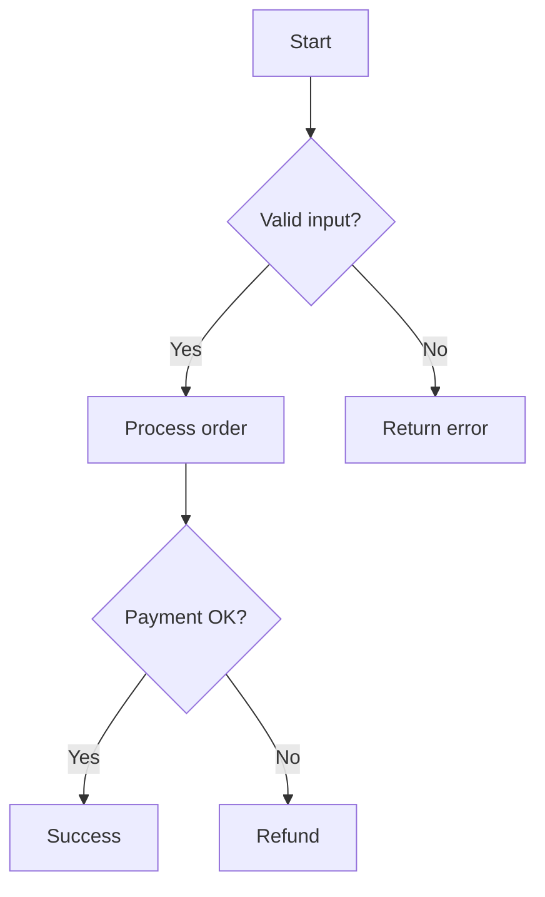
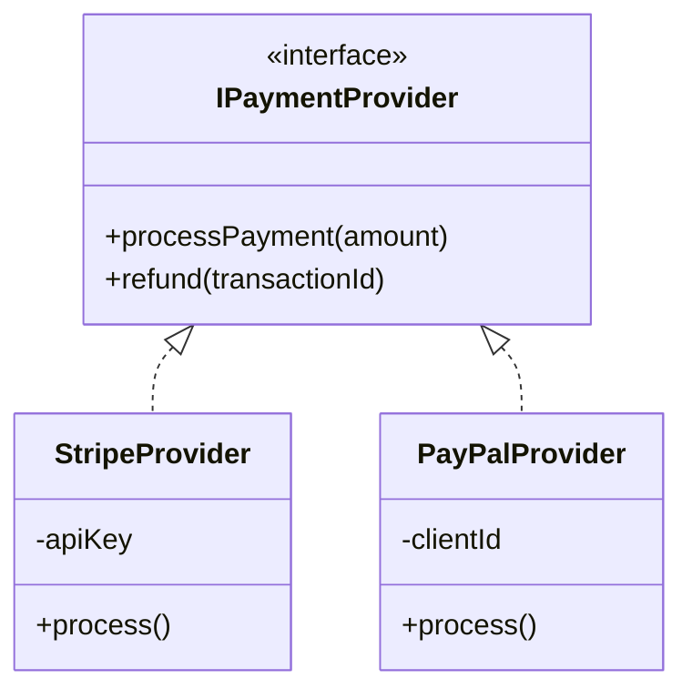

# Diagram Generation Workflow

You are helping a developer visualize code structure through diagrams.

## Core Principles

- **Accuracy over aesthetics**: Diagrams must reflect actual code structure
- **Keep it readable**: Don't overcrowd diagrams
- **Use appropriate type**: Match diagram type to what's being visualized

---

## Phase 1: Parse Request

**Goal**: Understand what to diagram

Initial request: $ARGUMENTS

**Actions**:
1. Parse the request:
   - **Target**: File, directory, or function name (required)
   - **Type**: `dependencies`, `sequence`, `flowchart`, or `class` (default: infer from target)
   - **--mermaid**: Use Mermaid syntax instead of ASCII (default: ASCII)
   - **--save=path.md**: Save diagram to a markdown file at specified path
   - **--copy**: Copy diagram to clipboard after displaying

2. Infer type if not specified:
   - Directory → dependencies
   - Function → sequence or flowchart
   - File with classes → class

3. If no arguments, ask: "What would you like me to diagram?"

---

## Phase 2: Analyze Target

**Goal**: Gather information for the diagram

**Actions vary by diagram type:**

### For Dependencies Diagram
1. Find all files in target directory
2. Parse imports/requires in each file
3. Build dependency graph
4. Identify:
   - Clusters of related files
   - Circular dependencies
   - External dependencies

### For Sequence Diagram
1. Find the target function
2. Trace its execution path
3. Identify actors (services, components, external systems)
4. Map the call sequence with:
   - Function calls
   - Async operations
   - Return values

### For Flowchart Diagram
1. Parse the target function
2. Identify control structures:
   - Conditionals (if, switch)
   - Loops (for, while)
   - Try/catch blocks
3. Map decision points and outcomes
4. Identify terminal states

### For Class Diagram
1. Find all classes/interfaces in target
2. Identify:
   - Inheritance (extends)
   - Implementation (implements)
   - Composition (class properties)
   - Associations

---

## Phase 3: Generate Diagram

**Goal**: Create the visual output

### Dependencies Diagram

**ASCII:**
```
                    ┌──────────────┐
                    │   index.ts   │
                    └──────┬───────┘
                           │
              ┌────────────┼────────────┐
              ▼            ▼            ▼
       ┌──────────┐ ┌──────────┐ ┌──────────┐
       │ auth.ts  │ │ api.ts   │ │ utils.ts │
       └────┬─────┘ └────┬─────┘ └──────────┘
            │            │
            └─────┬──────┘
                  ▼
           ┌──────────┐
           │  db.ts   │
           └──────────┘
```

**Mermaid:**


### Sequence Diagram

**ASCII:**
```
┌────────┐     ┌──────────┐     ┌──────────┐     ┌────────┐
│ Client │     │  Router  │     │ Service  │     │   DB   │
└───┬────┘     └────┬─────┘     └────┬─────┘     └───┬────┘
    │               │                │               │
    │  POST /order  │                │               │
    │──────────────▶│                │               │
    │               │ processOrder() │               │
    │               │───────────────▶│               │
    │               │                │  saveOrder()  │
    │               │                │──────────────▶│
    │               │                │    orderId    │
    │               │                │◀──────────────│
    │               │   { success }  │               │
    │               │◀───────────────│               │
    │   201 Created │                │               │
    │◀──────────────│                │               │
```

**Mermaid:**


### Flowchart Diagram

**ASCII:**
```
            ┌─────────────┐
            │   Start     │
            └──────┬──────┘
                   │
            ┌──────▼──────┐
            │ Valid input?│
            └──────┬──────┘
                   │
          ┌────────┴────────┐
          │ Yes             │ No
          ▼                 ▼
   ┌──────────────┐  ┌──────────────┐
   │Process order │  │ Return error │
   └──────┬───────┘  └──────────────┘
          │
   ┌──────▼───────┐
   │ Payment OK?  │
   └──────┬───────┘
          │
     ┌────┴────┐
     │Yes      │No
     ▼         ▼
┌─────────┐ ┌─────────┐
│ Success │ │ Refund  │
└─────────┘ └─────────┘
```

**Mermaid:**


### Class Diagram

**ASCII:**
```
┌─────────────────────────────┐
│      <<interface>>          │
│       IPaymentProvider      │
├─────────────────────────────┤
│ + processPayment(amount)    │
│ + refund(transactionId)     │
└──────────────┬──────────────┘
               │ implements
       ┌───────┴───────┐
       ▼               ▼
┌─────────────┐ ┌─────────────┐
│StripeProvider│ │PayPalProvider│
├─────────────┤ ├─────────────┤
│ - apiKey    │ │ - clientId  │
├─────────────┤ ├─────────────┤
│ + process() │ │ + process() │
└─────────────┘ └─────────────┘
```

**Mermaid:**


---

## Phase 4: Present Results

**Goal**: Deliver the diagram with context

**Actions**:
1. Generate the diagram in the appropriate format:
   - **Default**: ASCII art (always print to console)
   - **--mermaid**: Mermaid syntax instead of ASCII

2. Handle output options:
   - **--save=path.md**: Write the diagram to specified markdown file
     - Wrap in appropriate code fence (``` for ASCII, ```mermaid for Mermaid)
     - Include a title based on target and diagram type
   - **--copy**: Copy diagram to clipboard using `pbcopy` (macOS) or `xclip` (Linux)
     - Confirm to user: "Diagram copied to clipboard"

3. Add brief legend if needed

4. Note any limitations:
   - Files omitted for clarity
   - Depth limits applied
   - Circular dependencies found

5. Offer to:
   - Generate different diagram type
   - Focus on specific area
   - Use --mermaid, --save, or --copy if not already used

---

## Error Handling

- **Target not found**: Suggest similar files/functions
- **Too complex**: For large directories, suggest focusing on subdirectory
- **No classes found**: For class diagram on non-OOP code, suggest flowchart
- **Circular dependencies**: Highlight them with notation in diagram
