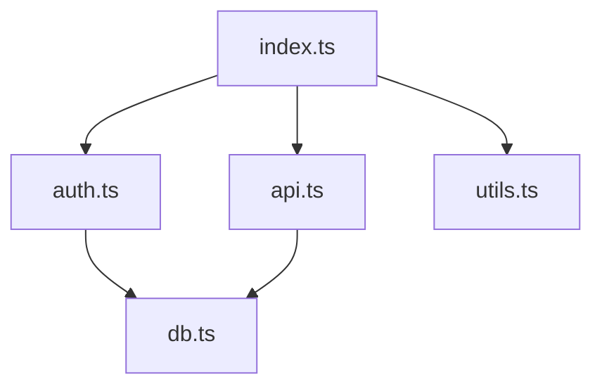
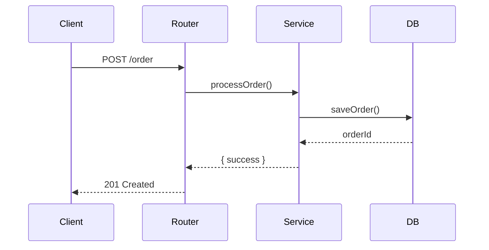
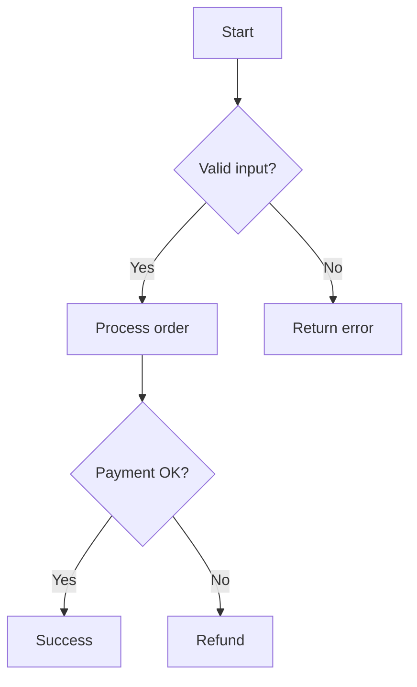
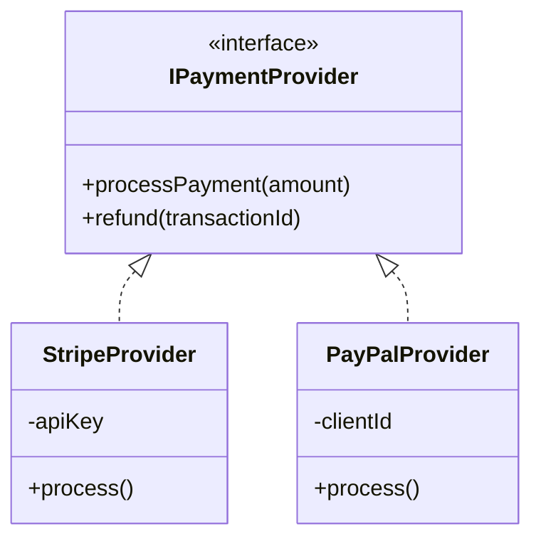

# Diagram Generation Workflow

You are helping a developer visualize code structure through diagrams.

## Core Principles

- **Accuracy over aesthetics**: Diagrams must reflect actual code structure
- **Keep it readable**: Don't overcrowd diagrams
- **Use appropriate type**: Match diagram type to what's being visualized

---

## Phase 1: Parse Request

**Goal**: Understand what to diagram

Initial request: $ARGUMENTS

**Actions**:
1. Parse the request:
   - **Target**: File, directory, or function name (required)
   - **Type**: `dependencies`, `sequence`, `flowchart`, or `class` (default: infer from target)
   - **--mermaid**: Use Mermaid syntax instead of ASCII (default: ASCII)
   - **--save=path.md**: Save diagram to a markdown file at specified path
   - **--copy**: Copy diagram to clipboard after displaying

2. Infer type if not specified:
   - Directory → dependencies
   - Function → sequence or flowchart
   - File with classes → class

3. If no arguments, ask: "What would you like me to diagram?"

---

## Phase 2: Analyze Target

**Goal**: Gather information for the diagram using parallel agents

**CRITICAL**: You MUST launch ALL required agents in a SINGLE tool call message. Do NOT wait for one agent to complete before launching the next. Use multiple Task tool invocations in a single response.

**Actions**:
1. Determine which agents to launch based on diagram type:
   - **dependencies**: context-gatherer
   - **sequence**: context-gatherer
   - **flowchart**: context-gatherer
   - **class**: context-gatherer AND pattern-identifier (BOTH in parallel)

2. Launch agents **in parallel** (single message with multiple Task tool calls):

   **context-gatherer agent** (all diagram types):
   - Trace imports, exports, and dependencies
   - Map call hierarchy (callers and callees)
   - Return JSON with: imports, exports, callers, callees, module_context

   **pattern-identifier agent** (class diagrams only):
   - Identify classes, interfaces, and their relationships
   - Detect inheritance and composition patterns
   - Return JSON with: design_patterns, framework_conventions, project_conventions

3. Wait for all agents to complete (they run concurrently)

4. Use agent outputs to build diagram data:

### For Dependencies Diagram
- Use `imports` and `exports` from context-gatherer
- Build dependency graph showing file relationships
- Identify clusters and circular dependencies

### For Sequence Diagram
- Use `callers` and `callees` from context-gatherer
- Map the call sequence between actors
- Include async operations and return values

### For Flowchart Diagram
- Use `callees` from context-gatherer for function flow
- Read target file to identify control structures (if, switch, loops, try/catch)
- Map decision points and terminal states

### For Class Diagram
- Use `design_patterns` from pattern-identifier
- Use `exports` from context-gatherer for class definitions
- Map inheritance, implementation, and composition relationships

---

## Phase 3: Generate Diagram

**Goal**: Create the visual output

### Dependencies Diagram

**ASCII:**
```
                    ┌──────────────┐
                    │   index.ts   │
                    └──────┬───────┘
                           │
              ┌────────────┼────────────┐
              ▼            ▼            ▼
       ┌──────────┐ ┌──────────┐ ┌──────────┐
       │ auth.ts  │ │ api.ts   │ │ utils.ts │
       └────┬─────┘ └────┬─────┘ └──────────┘
            │            │
            └─────┬──────┘
                  ▼
           ┌──────────┐
           │  db.ts   │
           └──────────┘
```

**Mermaid:**


### Sequence Diagram

**ASCII:**
```
┌────────┐     ┌──────────┐     ┌──────────┐     ┌────────┐
│ Client │     │  Router  │     │ Service  │     │   DB   │
└───┬────┘     └────┬─────┘     └────┬─────┘     └───┬────┘
    │               │                │               │
    │  POST /order  │                │               │
    │──────────────▶│                │               │
    │               │ processOrder() │               │
    │               │───────────────▶│               │
    │               │                │  saveOrder()  │
    │               │                │──────────────▶│
    │               │                │    orderId    │
    │               │                │◀──────────────│
    │               │   { success }  │               │
    │               │◀───────────────│               │
    │   201 Created │                │               │
    │◀──────────────│                │               │
```

**Mermaid:**


### Flowchart Diagram

**ASCII:**
```
            ┌─────────────┐
            │   Start     │
            └──────┬──────┘
                   │
            ┌──────▼──────┐
            │ Valid input?│
            └──────┬──────┘
                   │
          ┌────────┴────────┐
          │ Yes             │ No
          ▼                 ▼
   ┌──────────────┐  ┌──────────────┐
   │Process order │  │ Return error │
   └──────┬───────┘  └──────────────┘
          │
   ┌──────▼───────┐
   │ Payment OK?  │
   └──────┬───────┘
          │
     ┌────┴────┐
     │Yes      │No
     ▼         ▼
┌─────────┐ ┌─────────┐
│ Success │ │ Refund  │
└─────────┘ └─────────┘
```

**Mermaid:**


### Class Diagram

**ASCII:**
```
┌─────────────────────────────┐
│      <<interface>>          │
│       IPaymentProvider      │
├─────────────────────────────┤
│ + processPayment(amount)    │
│ + refund(transactionId)     │
└──────────────┬──────────────┘
               │ implements
       ┌───────┴───────┐
       ▼               ▼
┌─────────────┐ ┌─────────────┐
│StripeProvider│ │PayPalProvider│
├─────────────┤ ├─────────────┤
│ - apiKey    │ │ - clientId  │
├─────────────┤ ├─────────────┤
│ + process() │ │ + process() │
└─────────────┘ └─────────────┘
```

**Mermaid:**


---

## Phase 4: Present Results

**Goal**: Deliver the diagram with context

**Actions**:
1. Generate the diagram in the appropriate format:
   - **Default**: ASCII art (always print to console)
   - **--mermaid**: Mermaid syntax instead of ASCII

2. Handle output options:
   - **--save=path.md**: Write the diagram to specified markdown file
     - Wrap in appropriate code fence (``` for ASCII, ```mermaid for Mermaid)
     - Include a title based on target and diagram type
   - **--copy**: Copy diagram to clipboard using `pbcopy` (macOS) or `xclip` (Linux)
     - Confirm to user: "Diagram copied to clipboard"

3. Add brief legend if needed

4. Note any limitations:
   - Files omitted for clarity
   - Depth limits applied
   - Circular dependencies found

5. Offer to:
   - Generate different diagram type
   - Focus on specific area
   - Use --mermaid, --save, or --copy if not already used

---

## Error Handling

- **Target not found**: Suggest similar files/functions
- **Too complex**: For large directories, suggest focusing on subdirectory
- **No classes found**: For class diagram on non-OOP code, suggest flowchart
- **Circular dependencies**: Highlight them with notation in diagram
