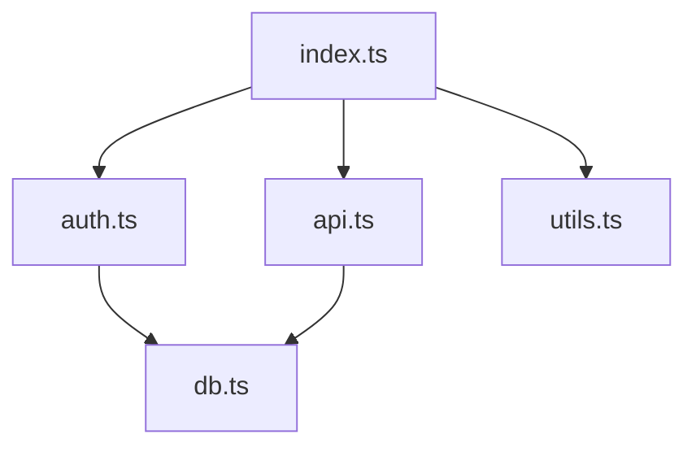
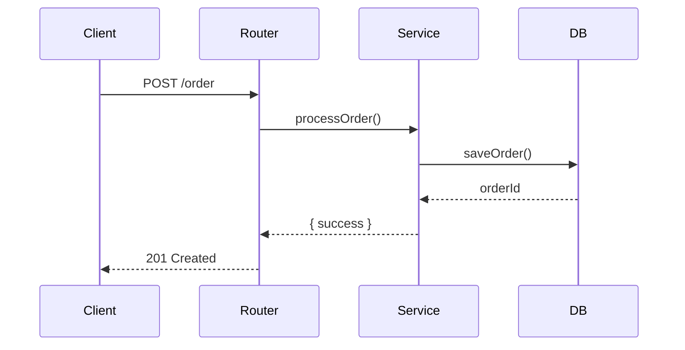
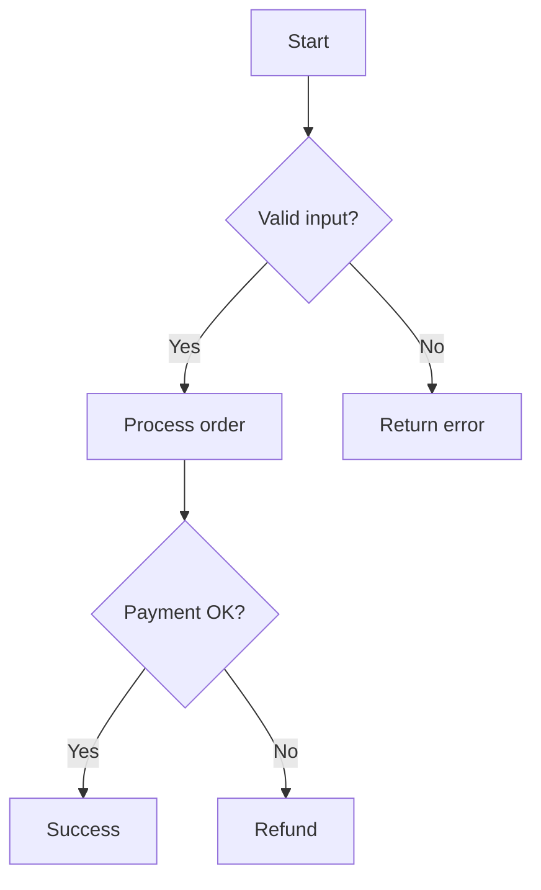
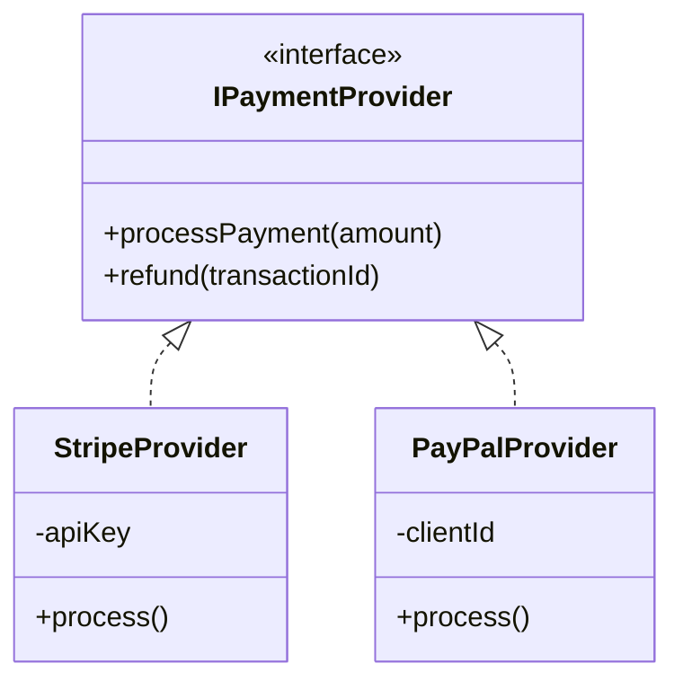

# Diagram Generation Skill

Generate visual diagrams showing code structure, dependencies, and relationships.

## Invocation

```
/diagram <target> [--type=TYPE] [--format=FORMAT]
```

**Parameters:**
- `target` - File, directory, or function name (required)
- `--type` - Diagram type: `dependencies`, `sequence`, `flowchart`, `class`
- `--format` - Output format: `ascii` (default) or `mermaid`

**Examples:**
```
/diagram src/services/ --type=dependencies
/diagram handlePayment --type=sequence
/diagram src/models/ --type=class --format=mermaid
/diagram processOrder --type=flowchart
```

## Diagram Types

### Dependencies (`--type=dependencies`)

Shows module/file dependencies and relationships.

**When to use:** Understanding how modules connect, finding circular dependencies, seeing the import graph.

**Analysis steps:**
1. Find all files in target directory
2. Parse imports/requires in each file
3. Build dependency graph
4. Identify clusters and circular deps

**ASCII output:**
```
                    ┌──────────────┐
                    │   index.ts   │
                    └──────┬───────┘
                           │
              ┌────────────┼────────────┐
              ▼            ▼            ▼
       ┌──────────┐ ┌──────────┐ ┌──────────┐
       │ auth.ts  │ │ api.ts   │ │ utils.ts │
       └────┬─────┘ └────┬─────┘ └──────────┘
            │            │
            └─────┬──────┘
                  ▼
           ┌──────────┐
           │ db.ts    │
           └──────────┘
```

**Mermaid output:**


### Sequence (`--type=sequence`)

Shows execution flow and function calls over time.

**When to use:** Understanding request handling, tracing data flow, documenting APIs.

**Analysis steps:**
1. Find the target function
2. Trace its execution path
3. Identify actors (services, components)
4. Map the call sequence

**ASCII output:**
```
┌────────┐     ┌──────────┐     ┌──────────┐     ┌────────┐
│ Client │     │  Router  │     │ Service  │     │   DB   │
└───┬────┘     └────┬─────┘     └────┬─────┘     └───┬────┘
    │               │                │               │
    │  POST /order  │                │               │
    │──────────────▶│                │               │
    │               │ processOrder() │               │
    │               │───────────────▶│               │
    │               │                │  saveOrder()  │
    │               │                │──────────────▶│
    │               │                │    orderId    │
    │               │                │◀──────────────│
    │               │   { success }  │               │
    │               │◀───────────────│               │
    │   201 Created │                │               │
    │◀──────────────│                │               │
```

**Mermaid output:**


### Flowchart (`--type=flowchart`)

Shows control flow and decision logic within a function.

**When to use:** Understanding complex conditionals, documenting algorithms, explaining branching logic.

**Analysis steps:**
1. Parse the target function
2. Identify control structures (if, switch, loops)
3. Map decision points and outcomes
4. Show terminal states

**ASCII output:**
```
            ┌─────────────┐
            │   Start     │
            └──────┬──────┘
                   │
            ┌──────▼──────┐
            │ Valid input?│
            └──────┬──────┘
                   │
          ┌────────┴────────┐
          │ Yes             │ No
          ▼                 ▼
   ┌──────────────┐  ┌──────────────┐
   │Process order │  │ Return error │
   └──────┬───────┘  └──────────────┘
          │
   ┌──────▼───────┐
   │ Payment OK?  │
   └──────┬───────┘
          │
     ┌────┴────┐
     │Yes      │No
     ▼         ▼
┌─────────┐ ┌─────────┐
│ Success │ │ Refund  │
└─────────┘ └─────────┘
```

**Mermaid output:**


### Class (`--type=class`)

Shows class/interface relationships, inheritance, and composition.

**When to use:** Understanding OOP structure, documenting APIs, seeing inheritance hierarchies.

**Analysis steps:**
1. Find all classes/interfaces in target
2. Identify inheritance (extends/implements)
3. Find composition (class properties)
4. Map relationships

**ASCII output:**
```
┌─────────────────────────────┐
│      <<interface>>          │
│       IPaymentProvider      │
├─────────────────────────────┤
│ + processPayment(amount)    │
│ + refund(transactionId)     │
└──────────────┬──────────────┘
               │ implements
       ┌───────┴───────┐
       ▼               ▼
┌─────────────┐ ┌─────────────┐
│StripeProvider│ │PayPalProvider│
├─────────────┤ ├─────────────┤
│ - apiKey    │ │ - clientId  │
├─────────────┤ ├─────────────┤
│ + process() │ │ + process() │
└─────────────┘ └─────────────┘
```

**Mermaid output:**


## Format Guidelines

**ASCII (default):**
- Use box-drawing characters: `┌ ┐ └ ┘ ─ │ ┬ ┴ ├ ┤ ┼`
- Use arrows: `▶ ◀ ▲ ▼ ──▶ ◀──`
- Keep width under 80 characters when possible
- Use consistent spacing

**Mermaid:**
- Output valid Mermaid syntax in fenced code block
- Use appropriate diagram type directive
- Include styling hints if complex

## Error Handling

- **Target not found:** Suggest similar files/functions
- **Too complex:** For large directories, suggest focusing on subdirectory
- **No classes found:** For class diagram on non-OOP code, suggest flowchart instead
- **Circular dependencies:** Highlight them in the diagram with notation
